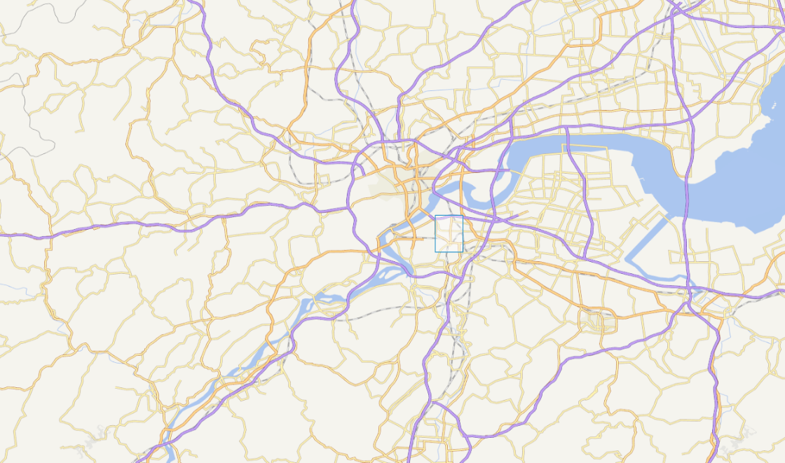
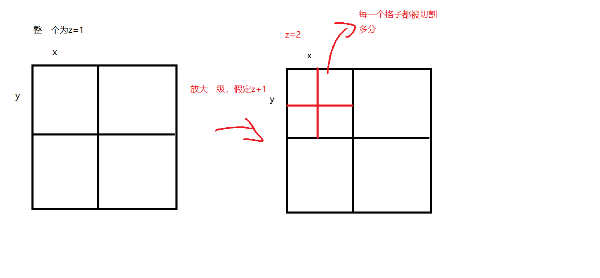
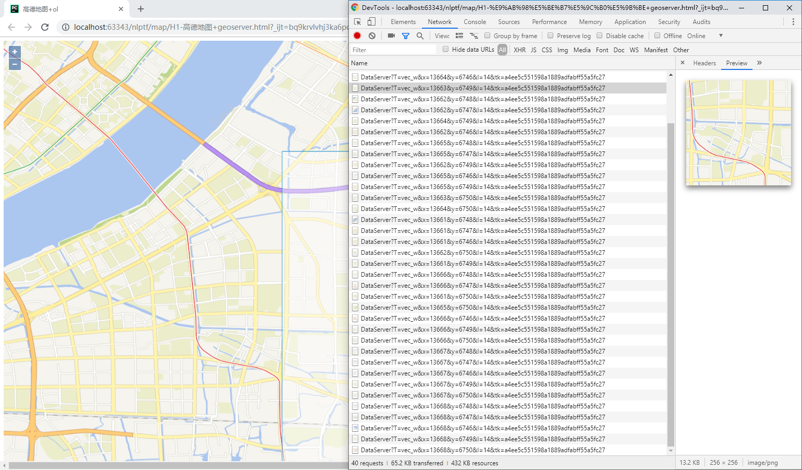
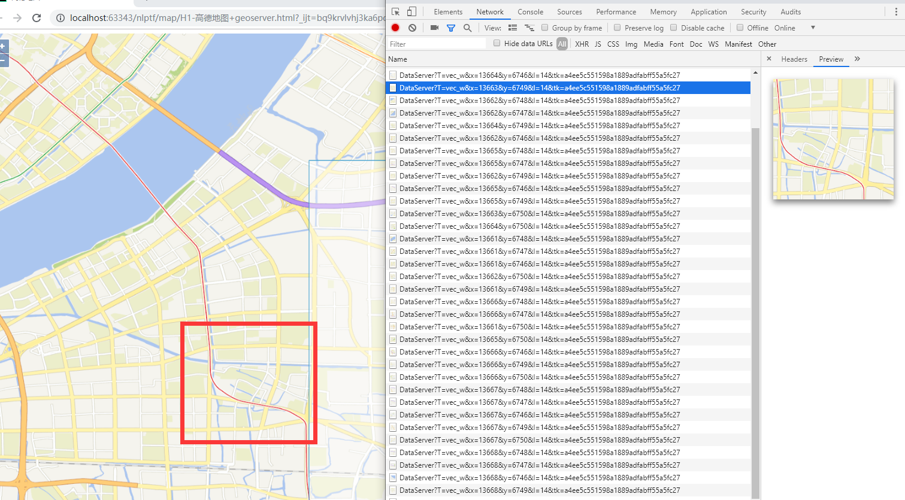
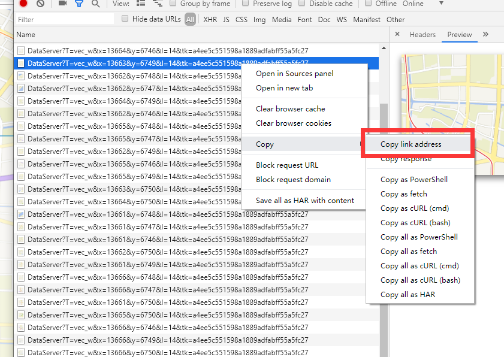
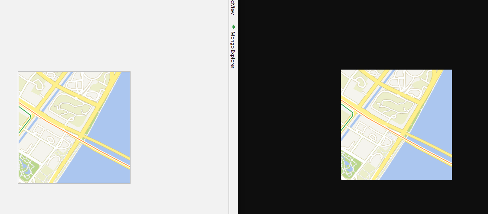
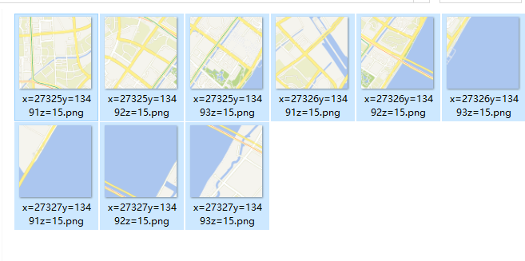
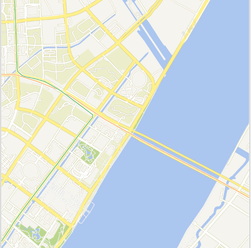
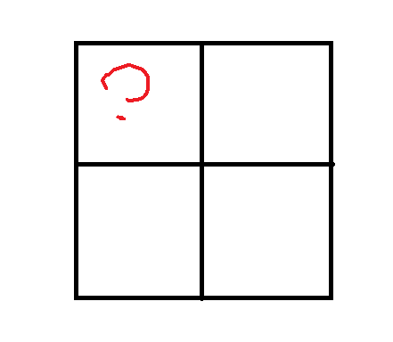

# 下载xyz地图

## 资源

- 下列为常用xyz路由地址
- 为了避免图片中出现文字标注（道路名称，建筑物名称等）本文选择天地图tian-vec 作为获取资源对象

```js
    var mapUrl = {
        /****
         * 高德地图
         * lang可以通过zh_cn设置中文，en设置英文，size基本无作用，scl设置标注还是底图，scl=1代表注记，
         * scl=2代表底图（矢量或者影像），style设置影像和路网，style=6为影像图，
         * vec——街道底图
         * img——影像底图
         * roadLabel---路网+标注
         */
        "aMap-img": "http://webst0{1-4}.is.autonavi.com/appmaptile?style=6&x={x}&y={y}&z={z}",
        "aMap-vec": "http://webrd0{1-4}.is.autonavi.com/appmaptile?lang=zh_cn&size=1&scale=1&style=8&x={x}&y={y}&z={z}",
        "aMap-roadLabel": "http://webst0{1-4}.is.autonavi.com/appmaptile?style=8&x={x}&y={y}&z={z}",
        /***
         * 天地图 要key的
         * vec——街道底图
         * img——影像底图
         * ter——地形底图
         * cva——中文注记
         * cta/cia——道路+中文注记 ---roadLabel
         */
        "tian-img": "http://t{0-7}.tianditu.gov.cn/DataServer?T=img_w&x={x}&y={y}&l={z}&tk=a4ee5c551598a1889adfabff55a5fc27",
        "tian-roadLabel": "http://t{0-7}.tianditu.gov.cn/DataServer?T=cta_w&x={x}&y={y}&l={z}&tk=a4ee5c551598a1889adfabff55a5fc27",
        "tian-label": "http://t{0-7}.tianditu.gov.cn/DataServer?T=cva_w&x={x}&y={y}&l={z}&tk=a4ee5c551598a1889adfabff55a5fc27",
        "tian-vec": "http://t{0-7}.tianditu.gov.cn/DataServer?T=vec_w&x={x}&y={y}&l={z}&tk=a4ee5c551598a1889adfabff55a5fc27",
        "tian-ter": "http://t{0-7}.tianditu.gov.cn/DataServer?T=ter_w&x={x}&y={y}&l={z}&tk=a4ee5c551598a1889adfabff55a5fc27",
        /***
         *geoq地图
         * http://cache1.arcgisonline.cn
         * http://map.geoq.cn
         * vec：标准彩色地图
         * gray、blue、warm
         * line 中国轮廓图
         * china 中国轮廓图+标注
         * Hydro 水系
         * green 植被
         */
        "geoq-vec": "http://cache1.arcgisonline.cn/arcgis/rest/services/ChinaOnlineCommunity/MapServer/tile/{z}/{y}/{x}",
        "geoq-gray": "http://cache1.arcgisonline.cn/arcgis/rest/services/ChinaOnlineStreetGray/MapServer/tile/{z}/{y}/{x}",
        "geoq-blue": "http://cache1.arcgisonline.cn/arcgis/rest/services/ChinaOnlineStreetPurplishBlue/MapServer/tile/{z}/{y}/{x}",
        "geoq-warm": "http://cache1.arcgisonline.cn/arcgis/rest/services/ChinaOnlineStreetWarm/MapServer/tile/{z}/{y}/{x}",
        "geoq-line": "http://cache1.arcgisonline.cn/arcgis/rest/services/SimpleFeature/ChinaBoundaryLine/MapServer/tile/{z}/{y}/{x}",//不稳定
        "geoq-china": "http://thematic.geoq.cn/arcgis/rest/services/ThematicMaps/administrative_division_boundaryandlabel/MapServer/tile/{z}/{y}/{x}",//不稳定
        "geoq-Hydro": "http://thematic.geoq.cn/arcgis/rest/services/ThematicMaps/WorldHydroMap/MapServer/tile/{z}/{y}/{x}",//不稳定
        "geoq-green": "http://thematic.geoq.cn/arcgis/rest/services/ThematicMaps/vegetation/MapServer/tile/{z}/{y}/{x}",//不稳定
        /***
         * Google
         * m 街道
         * s 影像
         */
        "google-vec": "http://www.google.cn/maps/vt?lyrs=m@189&gl=cn&x={x}&y={y}&z={z}",
        "google-img": "http://www.google.cn/maps/vt?lyrs=s@189&gl=cn&x={x}&y={y}&z={z}"

    };

```


## 展示资源

- 最终效果如下，矩形框内是我们需要获取的地图也就是需要爬虫下载的




```mermaid
graph TD
B(加载地图)
B--> c(点选选择范围)
c--> d(将范围绘制在地图上)

```


- 四个坐标转换成四至得到矩形

```python
xsq = "120.22940239501227;30.226915680225147;120.28948387694587;30.146807031535218"

xsqlist = xsq.split(";")

xsq_x_list = []
xsq_y_list = []

for i in range(len(xsqlist)):
    if i % 2 == 0:
        xsq_x_list.append(float(xsqlist[i]))
    else:
        xsq_y_list.append(float(xsqlist[i]))

xsq_x_y_list = []

for x, y in zip(xsq_x_list, xsq_y_list):
    xsq_x_y_list.append([float(x), float(y)])

MINX = min(xsq_x_list)
MAXX = max(xsq_x_list)
MINY = min(xsq_y_list)
MAXY = max(xsq_y_list)

print([MINX, MINY])
print([MINX, MAXY])
print([MAXX, MAXY])
print([MAXX, MINY])
print([MINX, MINY])
```


- 地图显示

```html
<!DOCTYPE html>
<html lang="en">
<head>
    <meta charset="UTF-8">
    <title>高德地图+ol</title>
    <link rel="stylesheet" href="https://cdnjs.cloudflare.com/ajax/libs/openlayers/4.6.5/ol.css"
          integrity="sha256-rQq4Fxpq3LlPQ8yP11i6Z2lAo82b6ACDgd35CKyNEBw=" crossorigin="anonymous"/>

    <script src="https://cdnjs.cloudflare.com/ajax/libs/openlayers/4.6.5/ol.js"
            integrity="sha256-77IKwU93jwIX7zmgEBfYGHcmeO0Fx2MoWB/ooh9QkBA="
            crossorigin="anonymous"></script>
    <style>
        #map {
            width: 100%;
            height: 100%;
            position: absolute;
        }
    </style>
</head>


<body>
<div id="map"></div>
<script type="text/javascript">

    
     var gaodeMapLayer = new ol.layer.Tile({
        title: "titile",
        source: new ol.source.XYZ({
            url: mapUrl["tian-vec"]
        })
    });

    var fa = new ol.layer.Vector({
        source: new ol.source.Vector({
            features: [new ol.Feature({
                geometry: new ol.geom.Polygon(
                    [[
                        [120.22940239501227, 30.146807031535218],
                        [120.22940239501227, 30.226915680225147],
                        [120.28948387694587, 30.226915680225147],
                        [120.28948387694587, 30.146807031535218],
                        [120.22940239501227, 30.146807031535218],


                    ]]
                ),
                name: 'pg'
            })]
        }),
    });


    var map = new ol.Map({
        layers: [gaodeMapLayer, fa],
        view: new ol.View({
            center: [120, 30],
            projection: 'EPSG:4326',
            zoom: 10
        }),
        target: 'map'
    });

// 点选地图用
    map.on('singleclick', function (e) {
        console.log(map.getEventCoordinate(e.originalEvent));

    })

</script>
</body>

</html>

```

## 爬虫开始

- 介绍XYZ 的规则

- 有兴趣可以查看  这篇博客：[openlayers-自定义瓦片](<https://blog.csdn.net/staHuri/article/details/88846239>)



- 根据图中描述，所需要素为 x ，y ，z 三者 ，在资源路由中不难看出 xyz 都是作为未知数

  ```json
  {"tian-vec": "http://t{0-7}.tianditu.gov.cn/DataServer?T=vec_w&x={x}&y={y}&l={z}&tk=a4ee5c551598a1889adfabff55a5fc27"}
  ```


### 浏览器调试

- 观察下图，我们可以发现右侧小图片中的那块内容在左侧出现






### 获取地址

使用同样的方式获取右下角地址 

- 左上角地址   http://t3.tianditu.gov.cn/DataServer?T=vec_w&x=27326&y=13492&l=15&tk=a4ee5c551598a1889adfabff55a5fc27
- 右下角地址 http://t4.tianditu.gov.cn/DataServer?T=vec_w&x=27333&y=13507&l=15&tk=a4ee5c551598a1889adfabff55a5fc27


#### 地址如何使用？

1. 不变的是z  在天地图url中是l ,本文示例**l=15**

2. 在地址中x y 存在关系： x 向右增加，y向下增加

   本文x范围 [   27326,27333                  ]

   本文y范围[   13492,   13507  ]

到目前所有参数准备就绪

- tips: 天地图的key 需要自己注册 ，本文已经提供了





### 代码怎么写？

#### 单个图片下载

- http://t3.tianditu.gov.cn/DataServer?T=vec_w&x=27326&y=13492&l=15&tk=a4ee5c551598a1889adfabff55a5fc27 以此为例


```python
import requests
import os

# 文件存放位置设置
BASE_PATH = os.path.join(os.path.abspath(os.curdir), 'disc')
print(BASE_PATH)

# 简单反爬虫 , 可以不写
headers = {
    "Connection": "keep-alive",
    "User-Agent": "Mozilla/5.0 (Windows NT 10.0; Win64; x64) AppleWebKit/537.36 (KHTML, like Gecko) Chrome/73.0.3683.86 Safari/537.36",
}

# 单个图片的参数
x = 27326
y = 13492
z = 15
key = 'a4ee5c551598a1889adfabff55a5fc27'
# 完整url
url = "http://t3.tianditu.gov.cn/DataServer?T=vec_w&x={}&y={}&l={}&tk={}".format(x, y, z, key)
# 保存文件名称
fileName = os.path.join(BASE_PATH, "x={}y={}z={}.png".format(x, y, z))
# 具体下载操作
if (os.path.exists(fileName)) == False:
    r = requests.get(url=url, headers=headers)
    if r.status_code == 200:
        with open(fileName, 'wb') as f:
            for chunk in r:
                f.write(chunk)

```



**下载成功** :happy:


#### 多图下载

```python
import requests
import os
# 文件存放位置设置
BASE_PATH = os.path.join(os.path.abspath(os.curdir), 'disc')
BASE_PATH_res = os.path.join(os.path.abspath(os.curdir), 'result')

# 简单反爬虫 , 可以不写
headers = {
    "Connection": "keep-alive",
    "User-Agent": "Mozilla/5.0 (Windows NT 10.0; Win64; x64) AppleWebKit/537.36 (KHTML, like Gecko) Chrome/73.0.3683.86 Safari/537.36",
}


def download_pic(x, y, z):
    try:
        # 下载图片
        key = 'a4ee5c551598a1889adfabff55a5fc27'
        for xi in x:
            for yi in y:
                url = "http://t3.tianditu.gov.cn/DataServer?T=vec_w&x={}&y={}&l={}&tk={}".format(xi, yi, z, key)
                # 保存文件名称
                fileName = os.path.join(BASE_PATH, "x={}y={}z={}.png".format(xi, yi, z))
                # 具体下载操作
                if (os.path.exists(fileName)) == False:
                    r = requests.get(url=url, headers=headers)
                    if r.status_code == 200:
                        with open(fileName, 'wb') as f:
                            for chunk in r:
                                f.write(chunk)
                    else:
                        print("访问异常")
    except Exception as e:
        print(e)
        pass
    
    
if __name__ == '__main__':
    x = range(27326 - 1, 27326 + 2)  
    y = range(13492 - 1, 13492 + 2)  
    z = 15
    picSize = 256
    download_pic(x, y, z)
```




至此我们将一部分图片下载完成 

#### 拼图

- 在上面多图下载结果中我们看到了很多一张张的图片和我们在地图上看到的不太一样，地图上的是一整张的，所以我们需要将这个图拼起来构造一张完整的图，如下图




- 我们将图想象成下图的形式，只需要知道每一个格子里面填写什么（图片名称）



```python
def merge_pic(x, y, z):
    picSize = 256
    try:
        # 构造平图矩阵
        li = []

        for xi in x:
            lis = []
            for yi in y:
                fileName = os.path.join(BASE_PATH, "x={}y={}z={}.png".format(xi, yi, z))
                lis.append(fileName)

            li.append(lis)

        oca = len(x)
        ocb = len(y)

        toImage = Image.new('RGBA', (oca * picSize, ocb * picSize))

        for i in range(oca):
            for j in range(ocb):
                fromImge = Image.open(li[i][j])
                picx = 256 * i
                picy = 256 * j
                loc = (picx, picy)
                toImage.paste(fromImge, loc)

        toImage.save(os.path.join(BASE_PATH_res, "rs.png"))
        print("构造完成输出图片")

    except  Exception as e:
        print(e)
        pass

```


#### 完整demo

```python
#! /usr/bin/env python
# -*- coding: utf-8 -*-

import requests
from PIL import Image
import os

# 文件存放位置设置
BASE_PATH = os.path.join(os.path.abspath(os.curdir), 'disc')
BASE_PATH_res = os.path.join(os.path.abspath(os.curdir), 'result')

# 简单反爬虫 , 可以不写
headers = {
    "Connection": "keep-alive",
    "User-Agent": "Mozilla/5.0 (Windows NT 10.0; Win64; x64) AppleWebKit/537.36 (KHTML, like Gecko) Chrome/73.0.3683.86 Safari/537.36",
}


def download_pic(x, y, z):
    try:
        # 下载图片
        key = 'a4ee5c551598a1889adfabff55a5fc27'
        for xi in x:
            for yi in y:
                url = "http://t3.tianditu.gov.cn/DataServer?T=vec_w&x={}&y={}&l={}&tk={}".format(xi, yi, z, key)
                # 保存文件名称
                fileName = os.path.join(BASE_PATH, "x={}y={}z={}.png".format(xi, yi, z))
                # 具体下载操作
                if (os.path.exists(fileName)) == False:
                    r = requests.get(url=url, headers=headers)
                    if r.status_code == 200:
                        with open(fileName, 'wb') as f:
                            for chunk in r:
                                f.write(chunk)
                    else:
                        print("访问异常")
    except Exception as e:
        print(e)
        pass


def merge_pic(x, y, z):
    picSize = 256
    try:
        # 构造平图矩阵
        li = []

        for xi in x:
            lis = []
            for yi in y:
                fileName = os.path.join(BASE_PATH, "x={}y={}z={}.png".format(xi, yi, z))
                lis.append(fileName)

            li.append(lis)

        oca = len(x)
        ocb = len(y)

        toImage = Image.new('RGBA', (oca * picSize, ocb * picSize))

        for i in range(oca):
            for j in range(ocb):
                fromImge = Image.open(li[i][j])
                picx = 256 * i
                picy = 256 * j
                loc = (picx, picy)
                toImage.paste(fromImge, loc)

        toImage.save(os.path.join(BASE_PATH_res, "rs.png"))
        print("构造完成输出图片")

    except  Exception as e:
        print(e)
        pass


if __name__ == '__main__':
    x = range(27326 - 1, 27326 + 2)
    y = range(13492 - 1, 13492 + 2)
    z = 15
    download_pic(x, y, z)
    merge_pic(x, y, z)
```